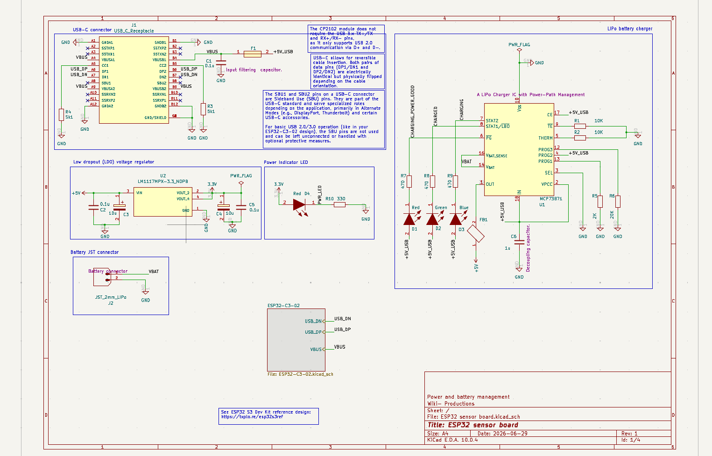
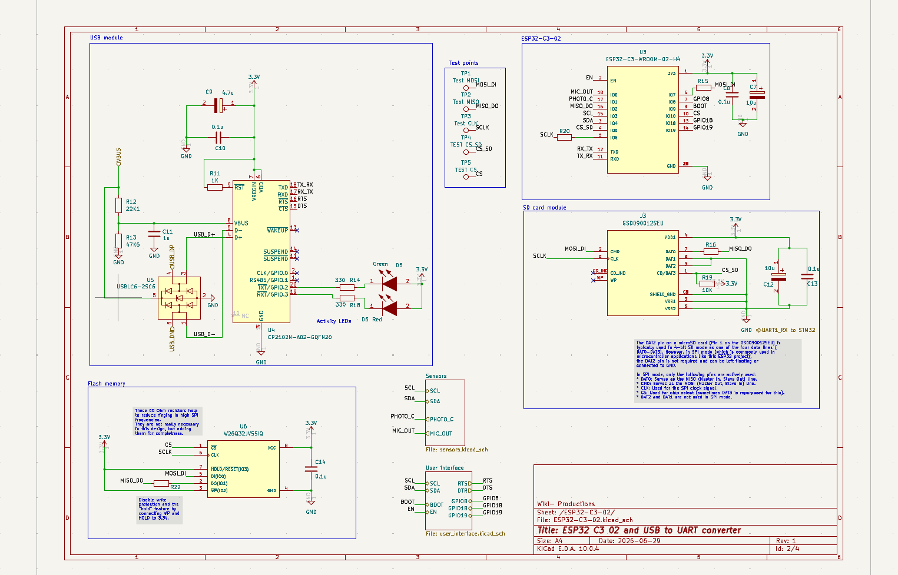
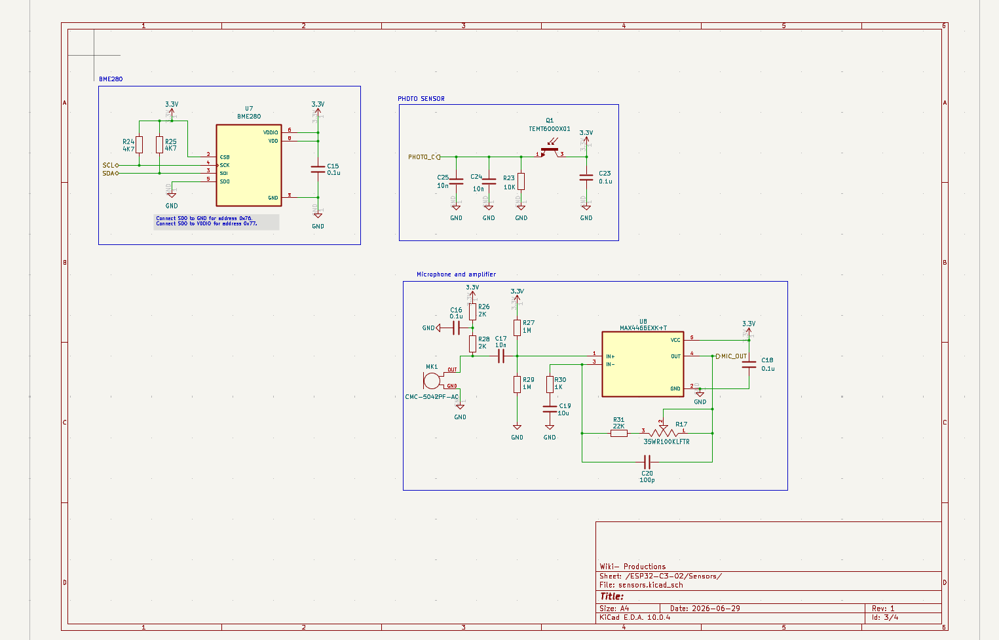
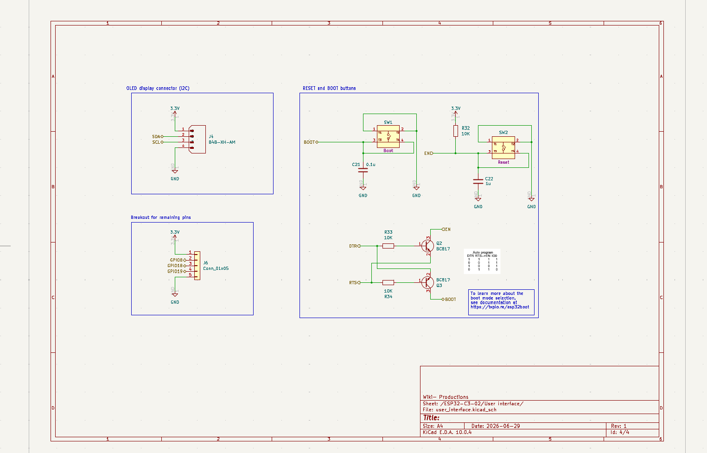
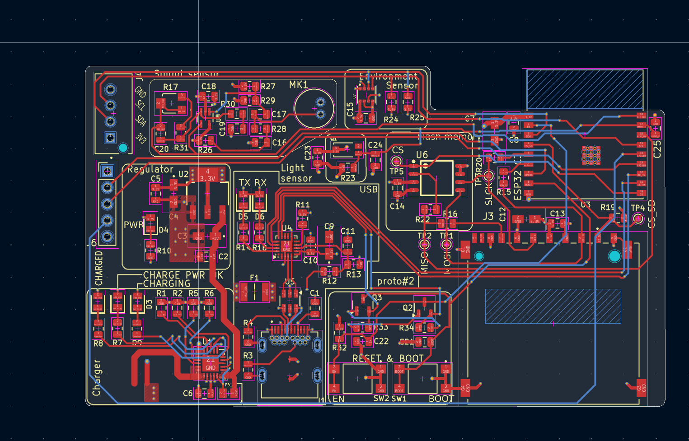
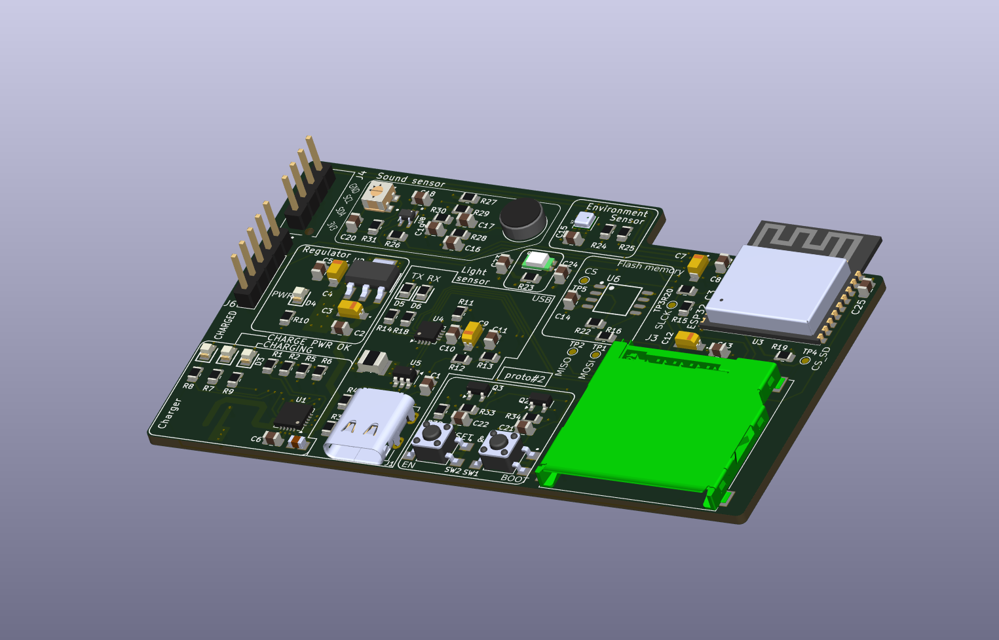

4-Layer ESP32 Sensor Board

A battery-powered, USB-C rechargeable ESP32-C3 sensor node integrating environmental (temperature/humidity/pressure), ambient light, and sound sensing, with onboard USB-to-UART programming, microSD data logging, and an I2C display header. This repository is a **revision** of the original 2-layer design, re-laid-out as a **4-layer PCB** (dedicated inner power/ground planes) for improved signal integrity and routing.

| | |
|---|---|
| **MCU/Module** | ESP32-C3-WROOM-02-H4 (U3) |
| **USB-UART Bridge** | Silicon Labs CP2102N-A02-GQFN20 (U4) |
| **Layers** | 4 (F.Cu, In1.Cu, In2.Cu, B.Cu) |
| **Interfaces** | USB-C (USB 2.0), I2C, microSD (SPI), SPI NOR flash, GPIO breakout |
| **Power** | USB-C 5 V input, single-cell LiPo (JST 2 mm), onboard charge management |
| **Revision** | 2 (4-layer revision) |
| **Status** | In development |

---

## Table of Contents

1. [Overview](#1-overview)
2. [Features](#2-features)
3. [Hardware Description](#3-hardware-description)
4. [Schematics](#4-schematics)
5. [PCB Layout](#5-pcb-layout)
6. [ESP32-C3 Pin Mapping](#6-esp32-c3-pin-mapping)
7. [Connector Pinout](#7-connector-pinout)
8. [Power Supply](#8-power-supply)
9. [Getting Started](#9-getting-started)
10. [Repository Structure](#10-repository-structure)
11. [Bill of Materials](#11-bill-of-materials)
12. [Revision History](#12-revision-history)

---

## 1. Overview

This board is a compact, self-contained sensor node built around the ESP32-C3-WROOM-02-H4 module. It integrates a BME280 environmental sensor, a TEMT6000 ambient light sensor, and an electret microphone with an adjustable-gain amplifier, alongside a microSD card slot and an external SPI NOR flash for local data logging. Power comes from either USB-C or a single-cell LiPo battery, with onboard charge management and power-path switching so the board can run and charge simultaneously. An onboard CP2102N provides USB-to-UART programming and an automatic reset/bootloader-entry circuit, so no external programmer is required.

This revision re-lays out the board on **4 copper layers** instead of 2, adding dedicated inner power (3.3 V) and ground planes. This improves return-path continuity and reduces plane impedance/noise for the analog sensor front-ends (microphone amplifier, light sensor) and the SPI/I2C digital buses, compared with the original 2-layer version.

## 2. Features

- **ESP32-C3-WROOM-02-H4** (U3) — RISC-V single-core Wi-Fi/BLE module
- **BME280** (U7) environmental sensor — temperature, humidity, and pressure over I2C, address-select pad for 0x76/0x77
- **TEMT6000X01** (Q1) ambient light phototransistor with RC-filtered analog output
- **Electret microphone** (MK1, CMC-5042PF-AC) with a **MAX4466EXK+T** (U8) op-amp amplifier and a trimmer potentiometer (R17, 100 kΩ) for adjustable gain
- **microSD card slot** (J3, GSD090012SEU) on a shared SPI bus
- **32 Mbit external SPI NOR flash** (U6, W25Q32JVSSIQ) sharing the same SPI bus with an independent chip select, for onboard data logging separate from the module's program flash
- **Onboard USB-to-UART bridge** (U4, CP2102N-A02-GQFN20) with USB ESD protection (U5, USBLC6-2SC6) — no external FTDI/CH340 adapter needed to program the board
- **Automatic reset/bootloader-entry circuit** using two BC817 transistors (Q2, Q3) driven from DTR/RTS, following the standard ESP32 auto-program sequence
- **USB-C power input** (J1) with 5.1 kΩ CC pull-downs for default 5 V/USB 2.0 negotiation
- **LiPo charge management** via a **MCP73871** charger IC (U1) with power-path management, tri-color charge-status LEDs (charging/charged/power-good), and battery connector (J2, JST 2 mm)
- **LM1117MPX-3.3** LDO (U2) regulates the system 3.3 V rail
- Manual **BOOT** and **RESET** buttons (SW1, SW2) in addition to the automatic DTR/RTS circuit
- I2C header (J4) for an external OLED display
- 5-pin breakout header (J6) exposing 3.3 V, GND, and three spare GPIOs (GPIO8, GPIO18, GPIO19)
- Five test points (TP1–TP5) on the shared SPI bus (MOSI, MISO, SCLK, CS_SD, CS) for debugging
- **4-layer stack-up** with dedicated inner 3.3 V and GND planes (this revision)

## 3. Hardware Description

**Power input and charging.** USB-C VBUS (J1) passes through a resettable fuse (F1) to the `+5V_USB` rail. This rail feeds a MCP73871 LiPo charger IC (U1) configured with power-path management: it charges a single-cell LiPo connected at J2 while simultaneously supplying the system load from its `OUT` pin, so the board can operate while charging. Three status outputs (`STAT1`, `STAT2`, `PG`) drive a red/green/blue LED trio (D1–D3) through 470 Ω resistors, giving a visual charge/power-good indication. `OUT` feeds through a ferrite bead (FB1) into an LM1117MPX-3.3 LDO (U2), which produces the board's 3.3 V rail used by every other block.

**MCU and USB programming.** The ESP32-C3-WROOM-02-H4 (U3) is the central module. A CP2102N-A02-GQFN20 USB-to-UART bridge (U4), protected by a USBLC6-2SC6 ESD array (U5) on the USB data lines, connects the module's TX/RX to the host PC and exposes green/red (D5/D6) activity LEDs on its GPIO.2/GPIO.3 lines. DTR and RTS from the CP2102N drive two BC817 transistors (Q2, Q3) that implement the standard auto-reset/auto-bootloader circuit on the `EN` and `BOOT` (GPIO9) lines, so the board can be flashed without manually holding a button. Manual BOOT (SW1) and RESET (SW2) buttons are also provided, each with an RC debounce network.

Notably, because the ESP32-C3's boot-mode strapping pin is GPIO9 (unlike the original ESP32, which straps on GPIO0), this design routes GPIO9 to the `BOOT` net for auto-programming and frees GPIO0 for use as an analog input for the microphone signal (`MIC_OUT`).

**Storage.** A microSD socket (J3, GSD090012SEU) and a 32 Mbit SPI NOR flash (U6, W25Q32JVSSIQ) share one SPI bus (`MOSI_DI`, `MISO_DO`, `SCLK`) with independent chip-select lines (`CS_SD`, `CS`). Series resistors (R15, R20, R22 — annotated on the schematic as ~50 Ω) sit on the shared bus lines to damp ringing at high SPI clock rates. Five test points (TP1–TP5) break out the same bus for probing.

**Sensors.** A BME280 (U7) provides temperature, humidity, and pressure over I2C, with SDA/SCL pull-ups (R24, R25) and a pad to select the I2C address by tying `SDO` to GND (0x76) or `VDDIO` (0x77) — this board ties it to GND. A TEMT6000X01 phototransistor (Q1) with a 10 kΩ pull-down (R23) and RC filtering forms a simple ambient-light sensor read as an analog voltage. An electret microphone (MK1) is biased and AC-coupled into a MAX4466EXK+T op-amp (U8) configured as a non-inverting amplifier; a 22 kΩ resistor plus a 100 kΩ trimmer potentiometer (R31, R17) in the feedback path set the gain, with a 100 pF capacitor (C20) rolling off high-frequency noise.

**User interface.** A 4-pin I2C header (J4, B4B-XH-AM) breaks out 3.3 V/SDA/SCL/GND for an external OLED display. A 5-pin header (J6) exposes 3.3 V, GND, and the three GPIOs (GPIO8/18/19) not otherwise used by the design.

**Stack-up (this revision).** The board was re-laid-out from 2 to 4 copper layers: `F.Cu` (top signal), `In1.Cu` (inner plane), `In2.Cu` (inner plane), `B.Cu` (bottom signal). The inner layers are used as continuous 3.3 V and GND planes, giving the top/bottom signal layers a solid adjacent reference plane and shortening high-frequency return paths for the SPI bus and analog front-ends.

## 4. Schematics

**Power and battery management** (root sheet — USB-C input, LiPo charger, LDO regulator, power-indicator LED, battery connector)



**ESP32-C3-02 and USB-to-UART converter** (MCU, CP2102N USB bridge, SPI flash, microSD module, test points)



**Sensors** (BME280, TEMT6000 light sensor, electret microphone and amplifier)



**User interface** (OLED I2C header, GPIO breakout header, reset/boot buttons, auto-program circuit)



## 5. PCB Layout

Four-layer board (top copper in red, bottom copper in blue, inner planes not separately colored in the 2D view) with a stepped outline: the sensor cluster (microphone, light sensor, BME280) sits along the top edge, charging/regulation/USB circuitry occupies the left and lower-left, and the ESP32 module, SPI flash, and microSD slot are grouped on the right where the board extends further along the top edge. A hatched keep-out zone sits directly next to the ESP32-C3-WROOM-02 footprint, consistent with the module's onboard PCB antenna clearance requirement. A second hatched/unpopulated zone, silkscreened `proto#2`, appears to be a reserved prototyping area. The layout includes multiple mounting holes and five silkscreened test points (TP1–TP5) on the shared SPI bus — exact hole counts, diameters, and keep-out dimensions should be confirmed against the PCB source file.



**3D Render**



## 6. ESP32-C3 Pin Mapping

Pin assignments below are read directly from the ESP32-C3-WROOM-02-H4 (U3) schematic symbol. Verify against the source design files prior to firmware development.

| Module Pin | GPIO | Net / Function |
|---|---|---|
| 1 | 3V3 | 3.3 V supply |
| 2 | EN | Chip enable / reset (auto-program + RESET button) |
| 18 | IO0 | `MIC_OUT` — microphone amplifier analog output |
| 17 | IO1 | `PHOTO_C` — light sensor analog output |
| 16 | IO2 | `MISO_DO` — shared SPI bus (flash + microSD) |
| 15 | IO3 | `SCL` — I2C clock (BME280, OLED header) |
| 3 | IO4 | `SDA` — I2C data (BME280, OLED header) |
| 4 | IO5 | `CS_SD` — microSD chip select |
| 5 | IO6 | `SCLK` — shared SPI bus clock (via R20) |
| 6 | IO7 | `MOSI_DI` — shared SPI bus data out (via R15) |
| 7 | IO8 | `GPIO8` — broken out to J6 |
| 8 | IO9 | `BOOT` — boot-mode strap / auto-program (via Q3) |
| 10 | IO10 | `CS` — SPI flash chip select |
| 13 | IO18 | `GPIO18` — broken out to J6 |
| 14 | IO19 | `GPIO19` — broken out to J6 |
| 12 | TXD | `RX_TX` — to CP2102N |
| 11 | RXD | `TX_RX` — from CP2102N |
| — | GND | Ground |

## 7. Connector Pinout

Pin assignments below are derived from the schematics. Verify against the source design files and PCB silkscreen prior to integration.

**J1 — USB-C Receptacle (USB 2.0 only)**

Standard USB-C receptacle; only the VBUS, GND, D+/D− and CC1/CC2 pins are used (SBU1/SBU2 and the SuperSpeed pairs are unconnected). CC1 and CC2 each carry a 5.1 kΩ pull-down (R4, R3) to present the board as a default-power USB 2.0 sink.

**J2 — Battery Connector (JST_2mm_LiPo)**

| Pin | Signal |
|-----|--------|
| 1 | VBAT (+) |
| 2 | GND |

**J3 — microSD Socket (GSD090012SEU), SPI mode**

| Pin | Signal |
|-----|--------|
| 4 | VDD1 (3.3 V) |
| 2 | CMD ← `MOSI_DI` |
| 5 | CLK ← `SCLK` |
| 7 | DAT0 → `MISO_DO` (pull-up R16) |
| 8 | DAT1 (not used in SPI mode) |
| 9 | DAT2 |
| 1 | CD/DAT3 → `CS_SD` (pull-up R19, 10 kΩ) |
| — | CD_IND, WP (not populated) |
| 3, 6 | VSS1/VSS2 (GND) |
| GS | SHIELD_GND |

**J4 — OLED Display Connector, I2C (B4B-XH-AM, 4-pin)**

| Pin | Signal |
|-----|--------|
| 1 | 3.3 V |
| 2 | SDA |
| 3 | SCL |
| 4 | GND |

**J6 — Spare GPIO Breakout (Conn_01x05, 5-pin)**

| Pin | Signal |
|-----|--------|
| 1 | 3.3 V |
| 2 | GPIO8 |
| 3 | GPIO18 |
| 4 | GPIO19 |
| 5 | GND |

**TP1–TP5 — Test Points**

| Test Point | Net |
|---|---|
| TP1 | MOSI_DI |
| TP2 | MISO_DO |
| TP3 | SCLK |
| TP4 | CS_SD |
| TP5 | CS |

## 8. Power Supply

| Parameter | Value |
|---|---|
| Input | USB-C 5 V (VBUS, via resettable fuse F1) or single-cell LiPo (J2) |
| Charger IC | MCP73871 (U1) — LiPo charger with power-path management |
| Regulator | LM1117MPX-3.3/NDPB (U2), LDO |
| System rail | 3.3 V |
| Charge status indication | Tri-color LED (D1 red / D2 green / D3 blue) driven from STAT2, STAT1/LBO, PG |
| Power-good indicator | Red LED (D4) on the 3.3 V rail via R10 (330 Ω) |
| Input filtering | C1 (0.1 µF) on VBUS; C2/C3 (0.1 µF/10 µF) on LDO input; C4/C5 (10 µF/0.1 µF) on LDO output; C6 (1 µF) on charger IN |

## 9. Getting Started

1. **Power:** Connect a USB-C cable to J1 for bench power/programming, and/or connect a single-cell LiPo battery to J2 for portable operation. The board can run while charging.
2. **Programming:** Connect the board to a host PC via USB-C. The onboard CP2102N enumerates as a serial port; the DTR/RTS auto-program circuit puts the ESP32-C3 into bootloader mode automatically when flashing (e.g. via `esptool.py` or the Arduino/PlatformIO/ESP-IDF toolchains). Use the BOOT (SW1) and RESET (SW2) buttons manually if auto-programming is disabled or unresponsive.
3. **Serial/communication:** The BME280 and any OLED display connected at J4 share the I2C bus on GPIO3 (SCL) / GPIO4 (SDA). The microSD card and external SPI flash share one SPI bus (GPIO6/7/2) with independent chip selects on GPIO5 (`CS_SD`) and GPIO10 (`CS`).
4. **Opening the design:** Open `hardware/kicad/ESP32 sensor board.kicad_pro` in KiCad 8/9+ to view or edit the schematic and 4-layer PCB layout.
5. **Fabrication:** Fabrication-ready Gerbers and drill files for the current 4-layer revision are in `hardware/gerbers/`, generated directly from the KiCad PCB source.

## 10. Repository Structure

```
.
├── docs/
│   └── images/
│       ├── schematic-power-management.png
│       ├── schematic-mcu-usb-uart.png
│       ├── schematic-sensors.png
│       ├── schematic-user-interface.png
│       ├── pcb-layout.png
│       └── pcb-3d-render.png
├── hardware/
│   ├── kicad/            # Full KiCad 4-layer project source (schematics, PCB, libraries, datasheets)
│   ├── gerbers/           # Fabrication-ready Gerber and drill files (4-layer)
│   └── bom.csv            # Bill of materials, exported from the schematic
└── README.md
```

## 11. Bill of Materials

A full bill of materials, generated from the schematic, is available at [`hardware/bom.csv`](hardware/bom.csv). Key components:

| Reference | Component | Description |
|---|---|---|
| U1 | MCP73871 | LiPo charger IC with power-path management |
| U2 | LM1117MPX-3.3/NDPB | 3.3 V LDO regulator |
| U3 | ESP32-C3-WROOM-02-H4 | Wi-Fi/BLE MCU module |
| U4 | CP2102N-A02-GQFN20 | USB-to-UART bridge |
| U5 | USBLC6-2SC6 | USB D+/D− ESD protection array |
| U6 | W25Q32JVSSIQ | 32 Mbit SPI NOR flash |
| U7 | BME280 | Environmental sensor (temperature/humidity/pressure) |
| U8 | MAX4466EXK+T | Microphone amplifier op-amp |
| Q1 | TEMT6000X01 | Ambient light phototransistor |
| Q2, Q3 | BC817 | NPN transistors, auto-reset/bootloader circuit |
| MK1 | CMC-5042PF-AC | Electret microphone |
| J1 | USB_C_Receptacle | USB-C connector |
| J2 | JST_2mm_LiPo | Battery connector |
| J3 | GSD090012SEU | microSD card socket |
| J4 | B4B-XH-AM | 4-pin JST-XH, OLED I2C connector |
| J6 | Conn_01x05 | 5-pin GPIO breakout header |
| SW1, SW2 | Tactile switch | BOOT and RESET buttons |
| D1–D3 | LED (RGB, discrete) | Charge status indicator |
| D4 | LED (red) | Power-good indicator |
| D5, D6 | LED (green/red) | USB activity indicators |
| F1 | Resettable fuse | VBUS overcurrent protection |
| FB1 | Ferrite bead | Charger output filtering |

## 12. Revision History

| Revision | Date | Notes |
|---|---|---|
| 1 | 2026-06-29 | Initial 2-layer design |
| 2 | 2026-09-09 | Revised to 4-layer stack-up with dedicated inner power/ground planes; gerbers and BOM regenerated for the new layout |

---

**Author:** Waqar-98
